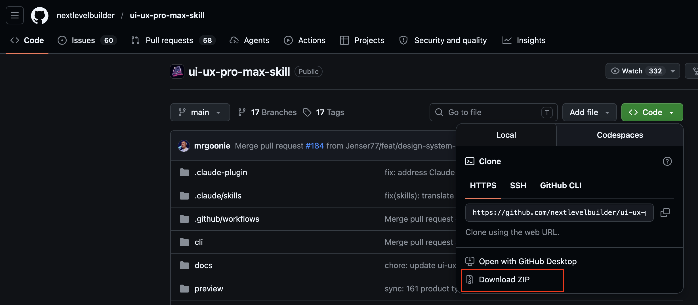
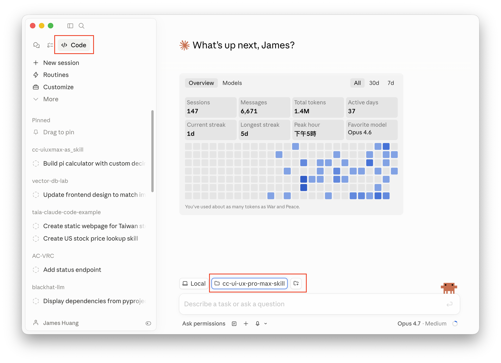
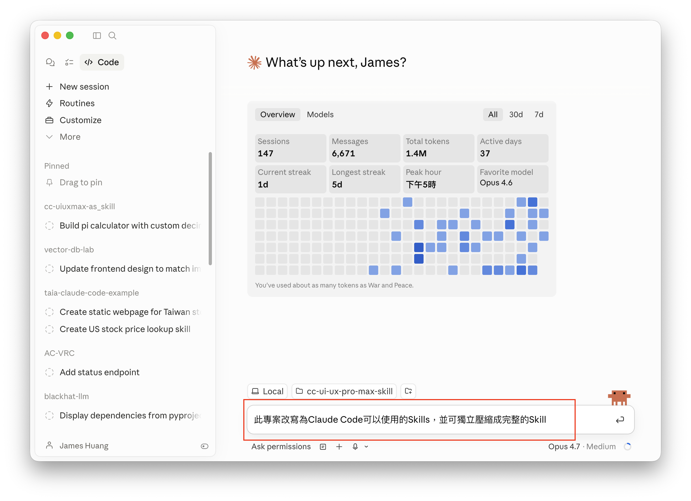
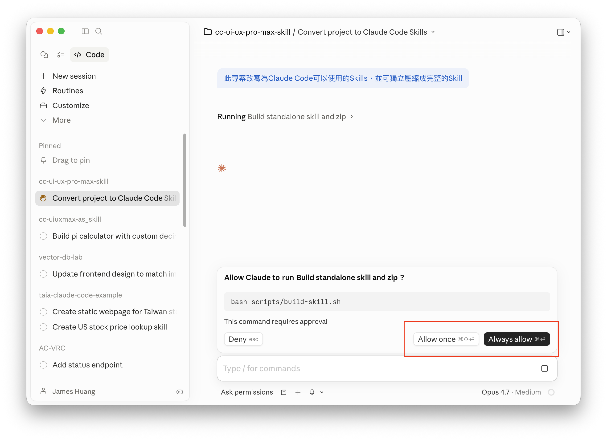
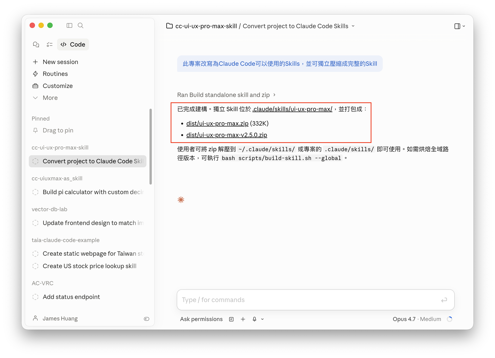
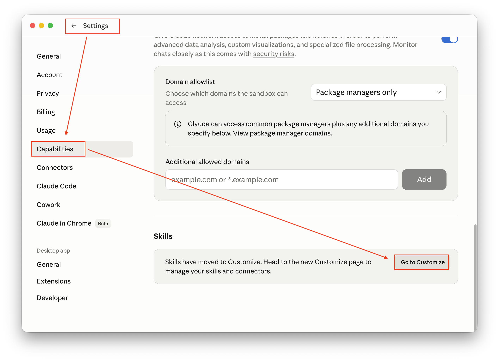
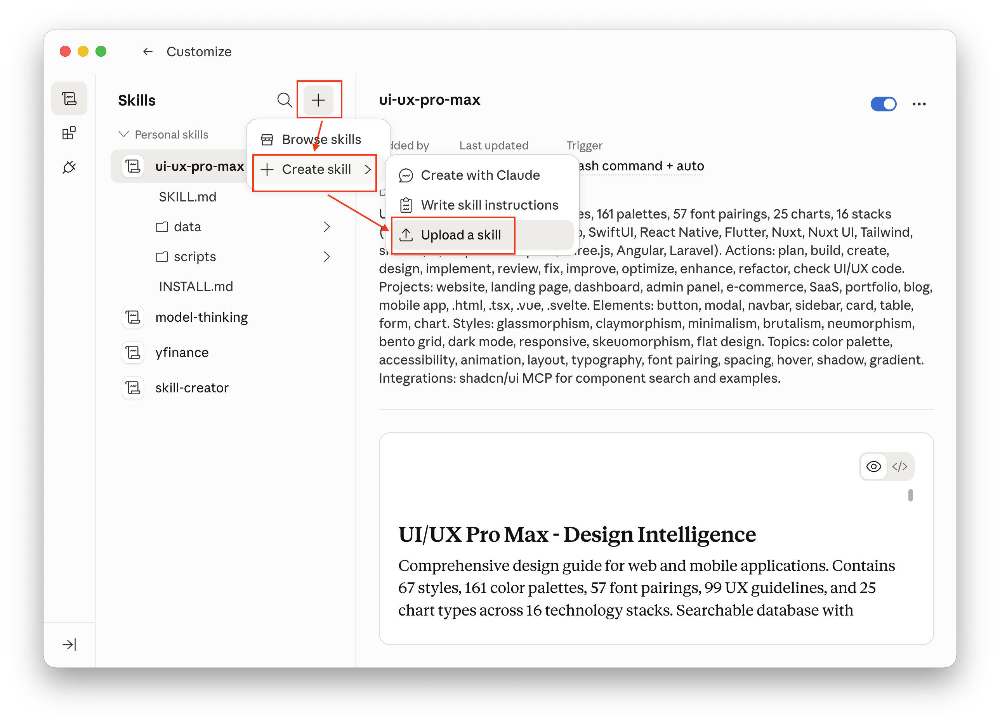
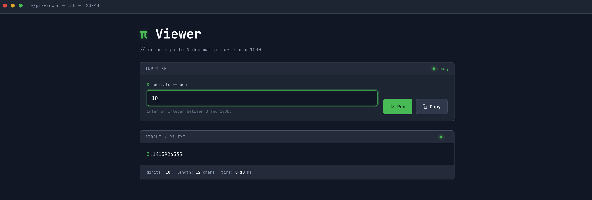
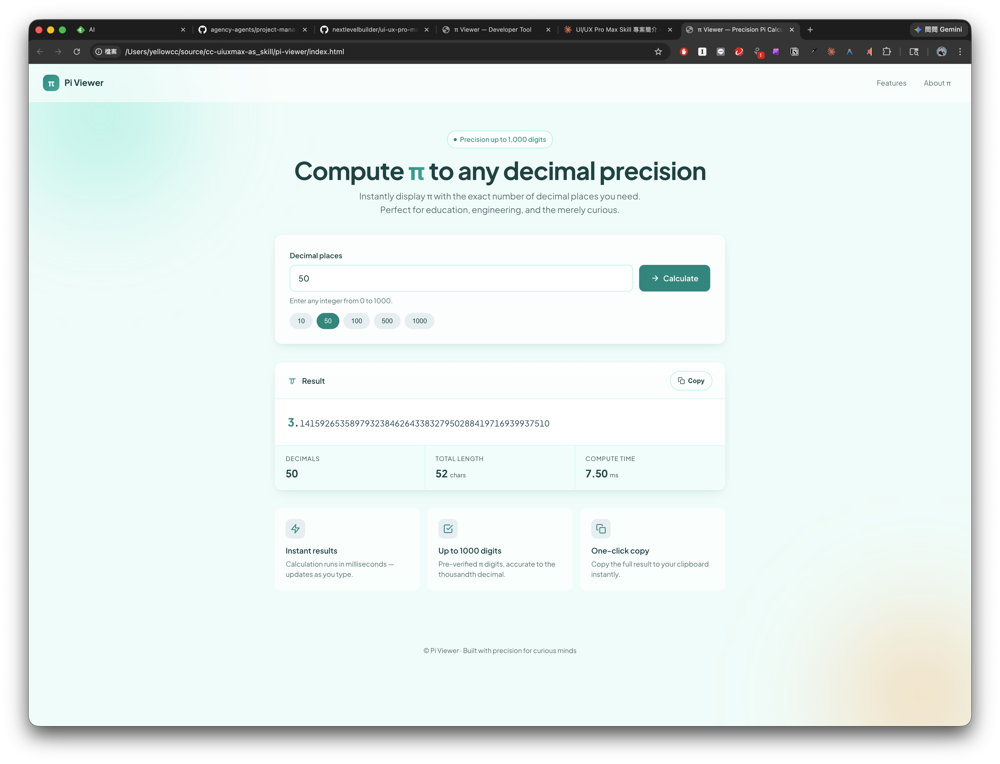

# Extra Lab - 召喚 Claude Code 將 Plugin 專案轉換為 Skill

Agent Skill 是一個非常彈性的延伸功能，Skill 的設計原則上也可以跨產品使用，例如在桌面版的Claude / Claude Code中，Skill是有可能可以共用的。

本範例示範如何將 UI-UX-PRO-MAX 這個 Plugin，在無需手動撰寫程式碼的情況下，召喚 Claude Code 將其轉換並封裝為 Skill，並在 Claude Code 中使用，用來產生不同風格樣示的網頁功能。

## 簡介 UI-UX-PRO-MAX

UI UX Pro Max 是一個開源的 AI 設計技能（AI Skill），專為各種 AI 編程助手打造，目的是讓 AI 在生成介面時具備「專業設計直覺」。它內建一個推理引擎，會根據產品類型自動生成完整的設計系統——包含版型結構、配色、字體、互動效果與反模式提醒。

專案涵蓋 67 種 UI 風格（如 Glassmorphism、Neumorphism、Bento Grid、AI-Native UI）、161 組產業色票、57 組字體配對、25 種圖表類型，以及 161 條產業專屬推理規則（橫跨 SaaS、金融、醫療、電商、創意等領域），另附 99 條 UX 最佳實踐守則。

技術上支援 15 種主流開發框架，包括 React、Next.js、Vue、Nuxt、Svelte、Astro、SwiftUI、Jetpack Compose、Flutter、React Native、Laravel 等。

安裝方式透過官方的 uipro-cli 一行指令即可整合到 Claude Code、Cursor、Windsurf、Copilot、Gemini CLI、Trae 等近 20 款 AI 開發工具。目前 GitHub 已累積約 68.9k stars，採用 MIT 授權。

UI UX Pro Max ([https://github.com/nextlevelbuilder/ui-ux-pro-max-skill](https://github.com/nextlevelbuilder/ui-ux-pro-max-skill))受到關注及歡迎，目前在 GitHub 上已獲約 7 萬顆星的評價。

---

## 在 Claude Code 中進行轉換、安裝、使用

本範例使用桌面版 Claude Code 進行示範，但操作原理適用於不同介面的 Claude Code。

1. 從 GitHub 下載 UI UX Pro Max 專案。如果需要的話，下載後解壓縮專案並儲存在硬碟中。



2. 在 Claude Code 中選擇該目錄，做為 Claude Code 的專案目錄。 



3. 輸入提示詞，指示 Claude Code 進行轉換。

提示詞：

```
將此專案改寫為Claude Code可以使用的Skills，並可獨立壓縮成完整的Skill
```



4. 過程中 Claude Code 會在需要時詢問，確認是否可執行。按 Allow once 或 Always allow 以繼續。



5. 執行完成後，可直接用壓縮包進行安裝，或是將整個壓縮檔解開放到專案的 .claude/skills r路徑下，即可使用。 



6. 到 Claude 桌面版程式進行安裝 





7. 使用

範例提示詞：

```
使用 ui-ux-pro-max skill，採用Developer Tool風格樣式，開發產生一頁網頁，可依照使用者輸入的小數點位數，顯示該位數的圓周率pi
```

範例畫面：



8. 重新設計

提示詞：

```
採用SaaS風格樣式，重新設計網頁
```



---

## 結論：這個Skill做了什麼？

### UI/UX Pro Max Skill 總結

這是一個**綜合性的 UI/UX 設計智能指南**，專為 Web 和 Mobile App 設計決策而打造。

### 核心資源庫

- **67 種設計風格**（玻璃擬態、極簡、新擬態、粗野主義等）
- **161 組配色方案**
- **57 種字體配對**
- **25 種圖表類型**
- **16 種技術棧**（React、Next.js、Vue、Svelte、SwiftUI、React Native、Flutter 等）
- **99 條 UX 指南**

#### 何時使用

**必須使用**：設計新頁面、創建/重構 UI 組件、選擇配色字體、審查 UI 代碼、實現導航動效、設計系統決策。

**跳過**：純後端邏輯、API/資料庫、DevOps、非視覺任務。

**判斷原則**：任務若改變「看起來如何、使用起來如何、如何運動或被交互」就該使用。

### 10 大優先級規則分類

按重要性排序：

1. **無障礙性（CRITICAL）** — 對比度 4.5:1、Alt text、鍵盤導覽、ARIA 標籤
2. **觸控與交互（CRITICAL）** — 最小 44×44px、8px 間距、載入回饋
3. **效能（HIGH）** — WebP/AVIF、Lazy loading、CLS < 0.1
4. **風格選擇（HIGH）** — 符合產品類型、一致性、SVG 圖標（禁用 emoji）
5. **佈局與響應式（HIGH）** — Mobile-first、無水平捲動、斷點一致
6. **字體與顏色（MEDIUM）** — 16px 基礎、行高 1.5、語義化色彩 token
7. **動畫（MEDIUM）** — 150–300ms、傳達意義、空間連續性
8. **表單與回饋（MEDIUM）** — 可見標籤、錯誤就近顯示、漸進式揭露
9. **導航模式（HIGH）** — 底部導覽 ≤5 項、可預測的返回、深層連結
10. **圖表與數據（LOW）** — 圖例、工具提示、無障礙色彩

### 工作流程（四步法）

1. **分析需求** — 產品類型、目標受眾、風格關鍵字、技術棧
2. **生成設計系統**（必做） — 使用 `--design-system` 指令獲取完整推薦（風格、配色、字體、效果、反模式）
   - 可用 `--persist` 保存為 Master + Overrides 結構（`design-system/MASTER.md` + `pages/` 頁面覆蓋）
3. **深入搜尋** — 按需用 `--domain`（product / style / color / typography / chart / ux / landing / react / web / prompt）
4. **技術棧指南** — 用 `--stack` 獲取特定框架實作建議

### 專業 UI 通用規則

涵蓋圖標（禁用 emoji、向量優先、Phosphor/Heroicons 圖標庫）、App 交互（觸控回饋、動畫時長、無障礙焦點）、明暗模式對比、佈局與間距（安全區域、8dp 節奏、內容寬度適配）。

### 交付前檢查清單

視覺品質 → 交互 → 明暗模式 → 佈局 → 無障礙性，逐項驗證後才交付代碼。

**核心價值**：將設計決策從「感覺」變成「可查詢、可驗證、可執行」的結構化知識庫，配合 Python CLI 工具（`search.py`）進行語義檢索，避免 UI 看起來「不夠專業」卻說不出原因的困境。

---

## 免責聲明

本文件及所有相關程式碼、圖片、操作步驟均為**示範用途**，僅供教學與學習參考。

- 本範例不保證適用於正式生產環境，使用者應自行評估風險。
- 所有內容均以「現狀」提供，不附帶任何明示或暗示的保證。
- 引用外部之資訊，版權屬原著作人所有。
