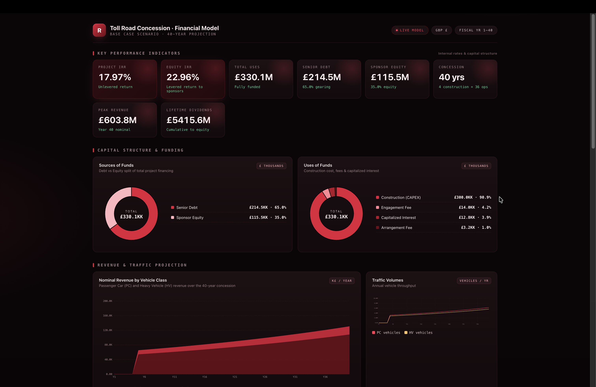
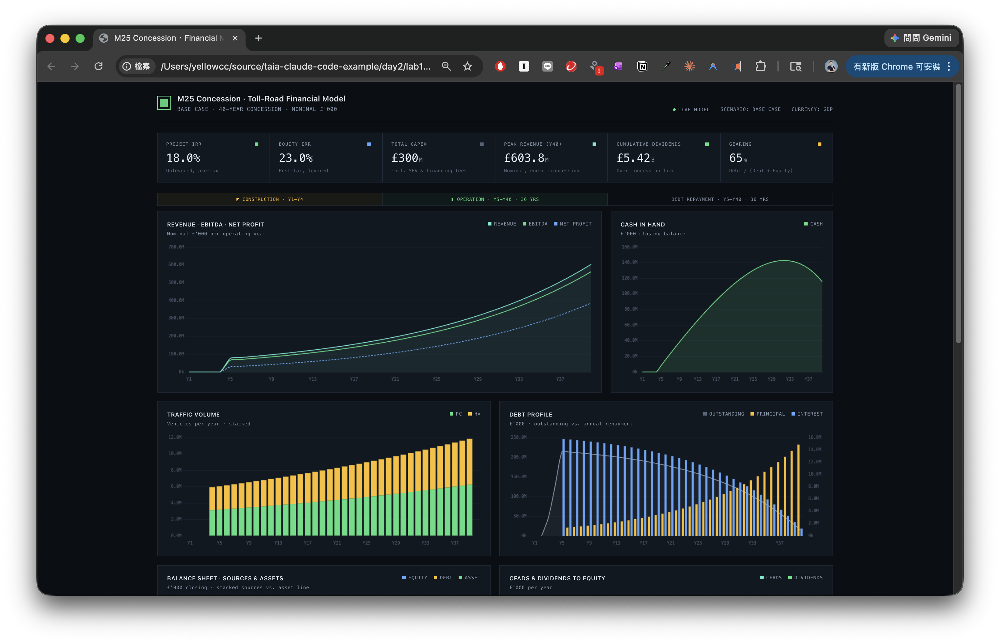

# Lab 1-2: 讀取 Excel 檔並建立網頁儀表板

## 操作步驟

1. 開啟 Claude Code，並選擇專案目錄；本範例中會用到以下兩個檔案

```
Financial_Model.xlsx
design_guidelines.md
```

2. 讓Claude Code讀取並產生檔案的摘要說明。輸入提示詞

```
產生 userguide.md 文件，說明 Excel 檔的內容與資訊

若需要使用Python，使用uv來進行管理
```

3. Claude Code會進行理解、規劃步驟、安裝必要的工具及套件，最後產生網頁程式碼

```
分析Excel檔並建立本地端單一HTML儀表板來呈現視覺化資料，設計規範參考 design_guidelines.md 檔案，風格設計為金融科技領域，色系採用紅色系

若需要使用Python，使用uv來進行管理

網頁須支援不同裝置及顯示解析度，確保網頁內容可完整顯示不須左右捲動

須可以在本地端運行不需要連網
```

4. 網頁儀表板產生後，開啟即可瀏覽



提示詞中不同的指示，可產生不同風格的顯示



---

## 免責聲明

本文件及所有相關程式碼、圖片、操作步驟均為**示範用途**，僅供教學與學習參考。

- 本範例不保證適用於正式生產環境，使用者應自行評估風險。
- 所有內容均以「現狀」提供，不附帶任何明示或暗示的保證。
- 引用外部之資訊，版權屬原著作人所有。
