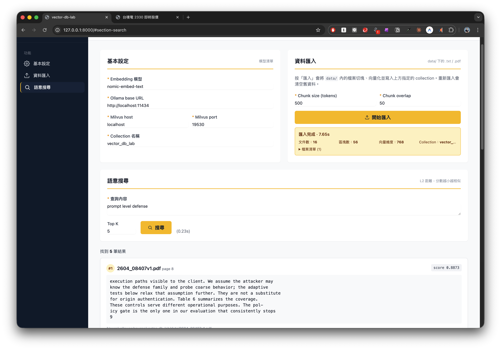

# Lab 2 - 招喚Claude Code更換頁面樣式

## 示範應用程式 - 向量資料庫的管理及測試

### 功能說明

示範一個使用向量資料庫的管理及測試頁面，包含下列特點：

- 使用 Ollama 來運行地端開源的 Embedding Model
- 使用者可自行管理及變更 Embedding Model
- 使用地端向量資料庫來儲存向量後的資料
- 提供使用者索引資料夾中的檔案，儲存到向量資料庫
- 提供查詢功能，回傳使用者指定的最接近資料數目

### 操作步驟

1. 開啟自己開發的應用程式，例如向量資料庫管理


2. 使用 Claude Code 開啟專案

3. 在Claude Code介面中，貼上欲更新的範例畫面 (或使用 `@圖檔檔名`)，並輸入提示詞

```prompt
套用這張圖片中的畫面設計風格，更新專案的前端網頁
```


4. Claude Code 自動進行重新設計

5. 設計完成後，網頁將更新為新的設計

