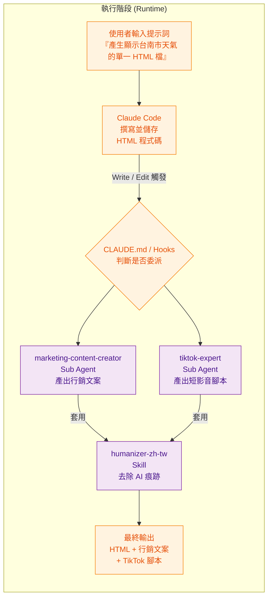
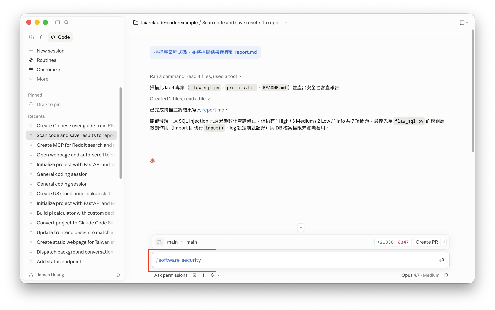
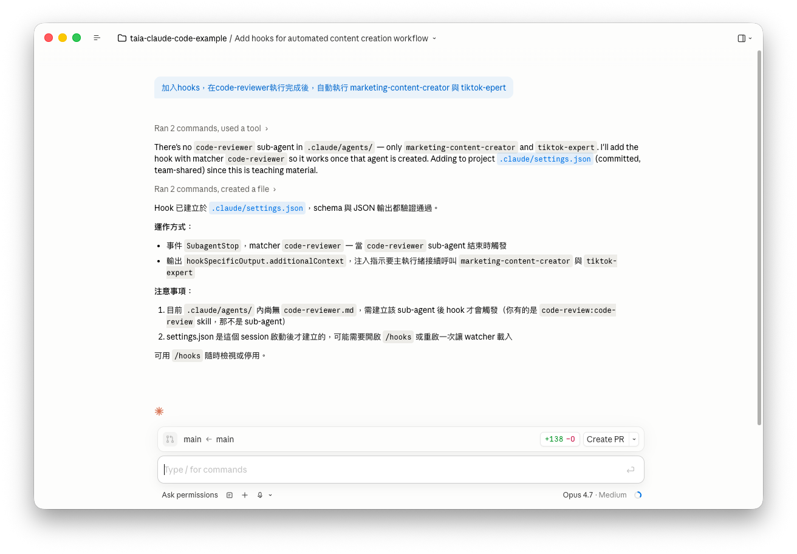
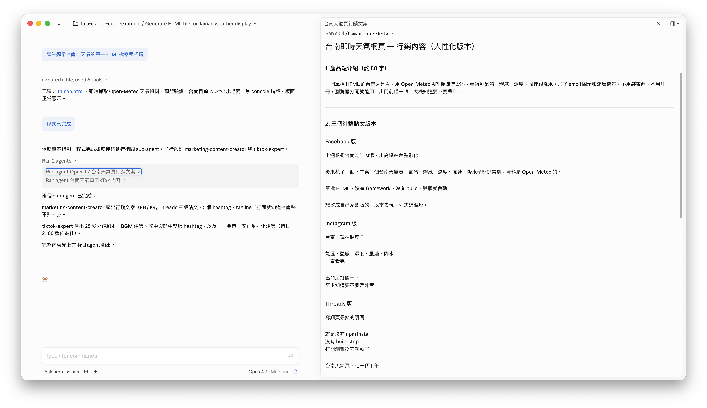

# Lab 4 "Sub Agents"：一人公司、多個 AI 代理人幫你完成任務

## 知識點

| 功能名稱 | 一句話簡介 |
| --- | --- |
| Sub Agents | 在主代理人之外建立具備獨立角色與系統提示的子代理人，可由主代理人依任務自動委派。 |
| Skill | 將特定工作流（如 Humanizer 文案潤飾）封裝為可重複呼叫的能力，在子代理人內部串接使用。 |
| Hooks | 在工具事件（如 `PostToolUse`）觸發時自動執行指令，串起多個 Sub Agent 形成自動化流程。 |
| CLAUDE.md | 專案層級的指令檔，向 Claude Code 描述專案目標、子代理人架構與委派規則。 |

## 簡介

本 Lab 以「一人公司」為情境，示範如何在 Claude Code 中組建 **多個 AI 代理人** 協同作業，讓開發、行銷、短影音腳本等不同職能由各自的 Sub Agent 接力完成。

學員將實作以下流程：

- 建立或下載現成的 **Sub Agent**（如 `marketing-content-creator`、`tiktok-expert`），放入 `.claude/agents/`
- 整合 **Humanizer-zh-TW Skill**，讓 AI 產出的文案更自然、有人味
- 透過 **CLAUDE.md** 指示主代理人在程式完成後接續呼叫 Sub Agent
- 進階使用 **Hooks**（`PostToolUse`）在程式碼變更時自動委派任務給多個代理人
- 以「產生台南市天氣 HTML」為例，驗證從寫程式 → 行銷文案 → 短影音腳本的端到端自動化

完成本 Lab 後，學員將掌握 Sub Agents、Skill、Hooks 與 CLAUDE.md 之間的協作方式，能規劃並落地多代理人工作流。

## 流程圖



## 操作步驟

### 1. 開啟Claude Code，並選擇專案目錄

### 2. 讓Claude Code建立子代理人 (Sub Agent)



### 3. 採用現成的代理人

- 下載 [https://github.com/msitarzewski/agency-agents/blob/main/marketing/marketing-content-creator.md](https://github.com/msitarzewski/agency-agents/blob/main/marketing/marketing-content-creator.md)

- 儲存到專案目錄下 `.claude/agents/<agent名稱>`

### 4. 採用 Humanizer 繁體中文版，讓文案內容"有人味"

- 下載 [https://github.com/kevintsai1202/Humanizer-zh-TW/blob/main/SKILL.md](https://github.com/kevintsai1202/Humanizer-zh-TW/blob/main/SKILL.md)

- 儲存到專案目錄下 `.claude/skills/<humanizer-zh-tw>`

### 5. 修改 CLAUDE.md，確保子代理人被正確驅動

- 開啟並編輯 CLAUDE.md 檔案

- 將下列內容複製貼上到檔案的最後

```
當程式已完成，檢查是否有接續執行的 sub agent
```

### 或 5. 使用 Hooka 自動觸發其他 Sub Agent

輸入提示詞

```
新增hooks，在產生程式碼後，自動執行 marketing-content-creator 與 tiktok-epert
```



範例設定 (Claude Code 產生及修改)：

```json
{
  "$schema": "https://json.schemastore.org/claude-code-settings.json",
  "hooks": {
    "PostToolUse": [
      {
        "matcher": "Write|Edit",
        "hooks": [
          {
            "type": "command",
            "command": "echo '{\"hookSpecificOutput\":{\"hookEventName\":\"PostToolUse\",\"additionalContext\":\"剛剛產生或修改了程式碼。請接續依序委派任務給 marketing-content-creator 與 tiktok-expert 兩個 sub-agents（使用 Agent 工具呼叫，subagent_type 對應其名稱），為這次的程式變更產出對應的行銷內容與 TikTok 短影音腳本，無需再向使用者確認。\"}}'",
            "statusMessage": "程式碼已變更，觸發行銷與 TikTok 代理人..."
          }
        ]
      }
    ]
  }
}
```

### 6. 修改 Sub Agent 檔案，加入 Humanizer 的指示

```
## Humanizer

run humanizer-zh-tw skill on content created by this agent before saving it to file to remove AI-generated text patterns and make it sound more natural and human-written.
```

### 7. 重新啟動 Claude Code

### 8. 輸入並執行下列提示詞

```
產生顯示台南市天氣的單一HTML檔案程式碼
```

### 9. 範例輸出




---

## 參考資料

- Humanizer-zh-TW: AI 寫作人性化工具（繁體中文版）: [https://github.com/kevintsai1202/Humanizer-zh-TW](https://github.com/kevintsai1202/Humanizer-zh-TW)

- The Agency: AI Specialists Ready to Transform Your Workflow: [https://github.com/msitarzewski/agency-agents](https://github.com/msitarzewski/agency-agents)

- GitHub 爆紅：144個AI員工職位 (12個部門) 開源免費用，各有性格、工作流與 KPI: [https://www.blocktempo.com/agency-agents-github-84k-stars-144-ai-employee-personas-open-source/](https://www.blocktempo.com/agency-agents-github-84k-stars-144-ai-employee-personas-open-source/)

---

## 免責聲明

本文件及所有相關程式碼、圖片、操作步驟均為**示範用途**，僅供教學與學習參考。

- 本範例不保證適用於正式生產環境，使用者應自行評估風險。
- 所有內容均以「現狀」提供，不附帶任何明示或暗示的保證。
- 引用外部之資訊，版權屬原著作人所有。
