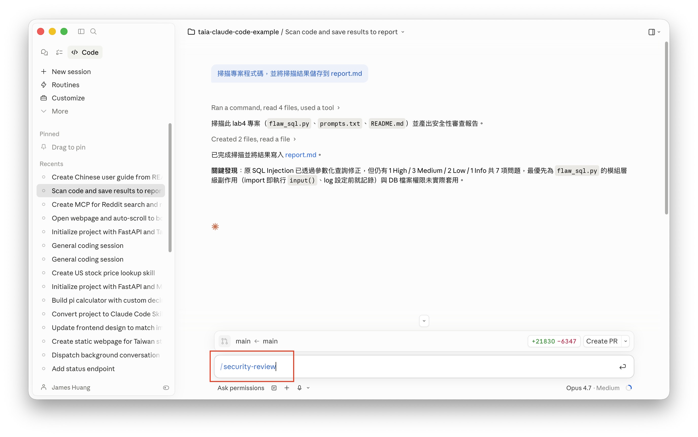

# Lab 5 "Rules"：在Claude Code中，執行程式碼安全性檢查

## 知識點

| 功能名稱 | 一句話簡介 |
| --- | --- |
| 記憶 (Memory) | 跨對話保存使用者偏好、專案狀態與規範，讓 Claude Code 能持續一致地協作。 |
| Skill | 將既定工作流（如安全掃描）封裝成可由自然語言或斜線指令觸發的可重用能力。 |
| Rules | 透過規則檔約束 Claude 在程式撰寫與審查時遵循的安全與品質標準。 |

## 簡介

本 Lab 介紹如何在 Claude Code 中導入 **Project CodeGuard**（由 Coalition for Secure AI / CoSAI 推出的 AI 編碼安全框架），藉此提升 AI 生成程式碼的安全性。

學員將實作以下流程：

- 將 CodeGuard 的 **Skill** 與 **Rules** 引入專案目錄
- 透過自然語言提示或 `/security-review` 斜線指令對程式碼進行安全掃描
- 產出可追蹤的 `report.md` 報告，協助識別常見漏洞（如輸入驗證不足、硬編碼機密、弱加密、缺少身分驗證等）

完成本 Lab 後，學員將了解如何結合 **記憶 / Skill / Rules** 三者，讓 Claude Code 成為具備安全意識的程式撰寫夥伴。

## Project CodeGuard

**Project CodeGuard** 是由 **Coalition for Secure AI (CoSAI)** 所開發的框架，目的是將安全最佳實務整合進 AI 編碼代理（AI Coding Agent）的工作流程中。

隨著 AI 程式碼生成工具普及，許多常見的安全漏洞也隨之出現，例如：

- 輸入驗證不足
- 硬編碼（Hardcoded）密碼與機密資訊
- 使用弱加密演算法
- 缺少身分驗證檢查

CodeGuard 即是為了解決這些問題而生，協助開發者與 AI 助理一同產出更安全的程式碼。

## 用 Project CodeGuard 提供的 Skill 檢查程式碼是否安全

### 1. 下載並複製 Project CodeGuard 到專案目錄中

### 2. 執行 Skill，或是用自然語言，輸入提示詞

```
掃描專案程式碼，並將掃描結果儲存到 report.md
```
或
```
/security-review
```




---

## 免責聲明

本文件及所有相關程式碼、圖片、操作步驟均為**示範用途**，僅供教學與學習參考。

- 本範例不保證適用於正式生產環境，使用者應自行評估風險。
- 所有內容均以「現狀」提供，不附帶任何明示或暗示的保證。
- 引用外部之資訊，版權屬原著作人所有。
