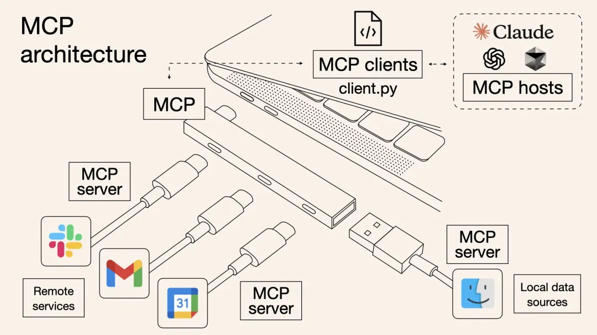
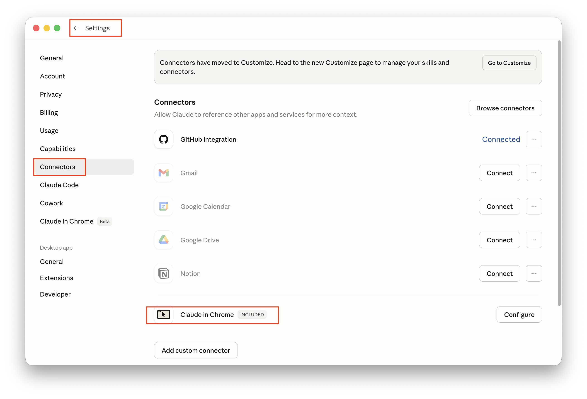
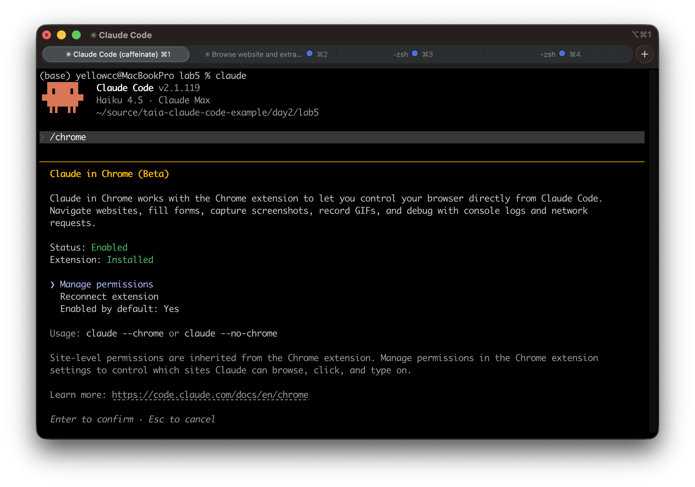
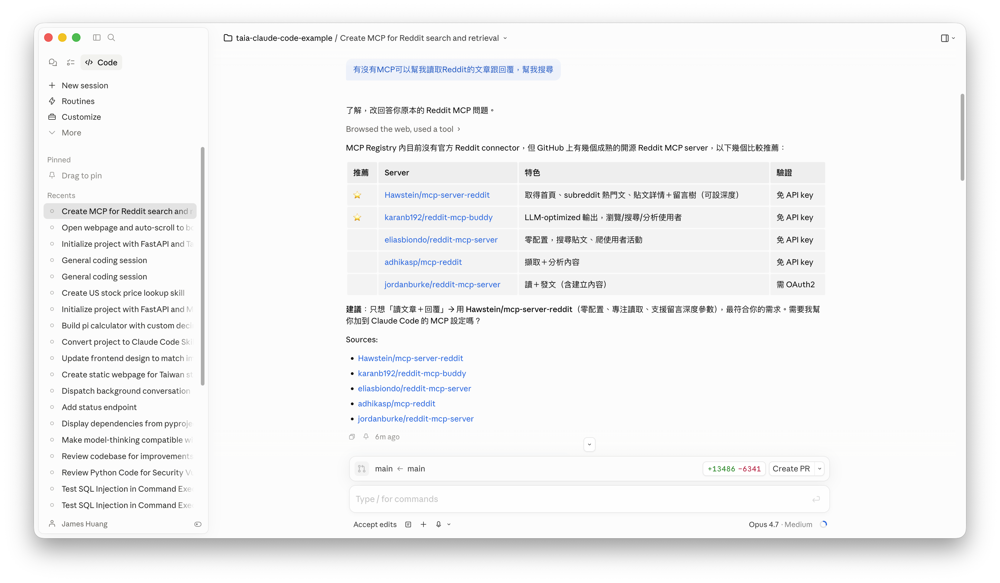
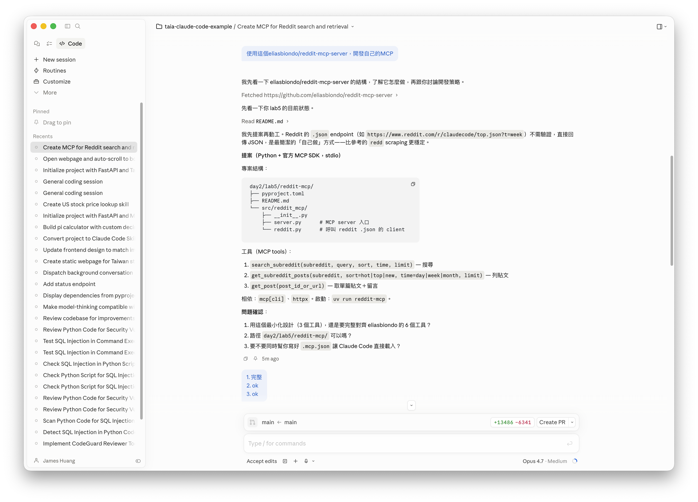
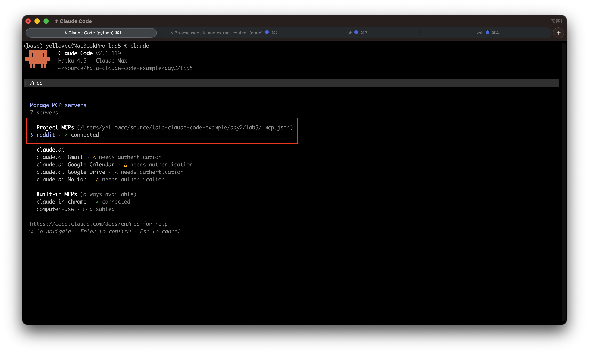
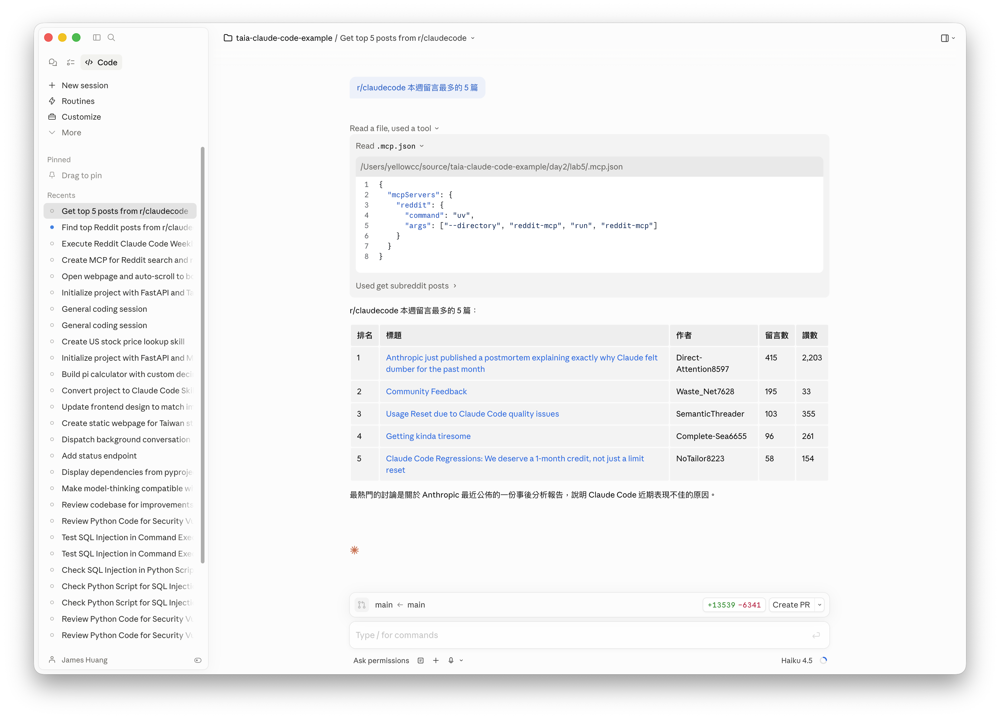
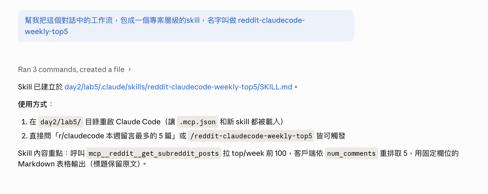
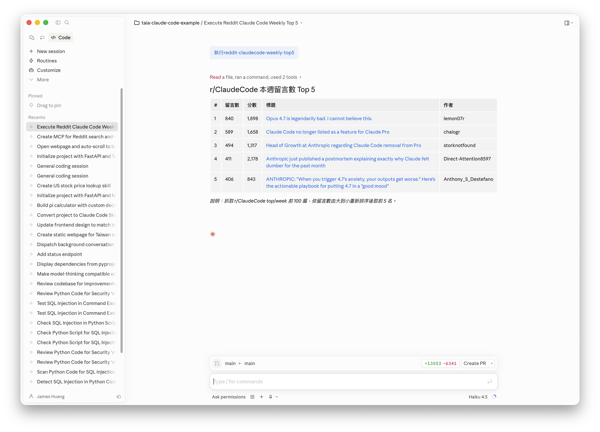

# Lab 6 "MCP"

## 知識點

| 功能名稱 | 一句話簡介 
| --- | --- |
| Claude for Chrome | 以 MCP 形式提供的瀏覽器外掛，讓 Claude 可遙控分頁、讀取頁面與執行操作。 |
| MCP Server 開發 | 自行打造 MCP 服務，將任意 API 或資料源（如 Reddit）封裝給 Claude 使用。 |
| Skill | 將一段對話工作流打包成可重複觸發的專案層級技能，支援自然語言或斜線指令呼叫。 |


## MCP: 大模型界Agent的統一接口(通訊埠)



圖片來源：[https://modelcontextprotocol.info/zh-tw/blog/understanding-mcp-protocol/](https://modelcontextprotocol.info/zh-tw/blog/understanding-mcp-protocol/)

## 簡介

本 Lab 介紹 **MCP (Model Context Protocol)** 的應用與開發，透過兩個實作 Part 帶領學員體驗 MCP 的能力：

- **Part 1：使用現成 MCP** — 透過 Claude for Chrome 外掛，讓 Claude Code 能夠遙控瀏覽器，自動開啟網頁、讀取內容並進行頁面捲動操作。
- **Part 2：開發自己的 MCP Server** — 以 Reddit 為例，從搜尋既有 MCP、建立自製 MCP Server，到串接 Claude Code 查詢 r/claudecode 熱門貼文，最後將整套工作流封裝成專案層級的 Skill 重複使用。

完成本 Lab 後，學員將能理解 MCP 如何擴充 Claude Code 與外部工具及服務的整合能力，並掌握「使用 MCP → 開發 MCP → 包裝 Skill」的完整流程。

## Part 1. 遙控瀏覽器開啟網頁並讀取內容

### 確保 Claude for Chrome 已安裝

打開Google Chrome瀏覽器，安裝Claude for Chrome外掛

安裝網址：[https://chromewebstore.google.com/detail/claude/fcoeoabgfenejglbffodgkkbkcdhcgfn](https://chromewebstore.google.com/detail/claude/fcoeoabgfenejglbffodgkkbkcdhcgfn)

### 檢查Claude Code及MCP設定

#### Claude 桌面版



#### Claude Code CLI



## 使用 Claude for Chrome (MCP)

### 1. 保持 Chrome 開啟

### 2. 開啟 Claude Code

### 3. 輸入下列提示詞

```
幫我打開 https://udn.com/news/story/124061/9458637 , 並顯示頁面標題和第一段文字
若網頁無法一頁看完，使用瀏覽器工具每3秒自動page down，捲到頁尾就停止捲動
自動允許所有Claude要求的動作
```

--- 

## Part 2. 開發一個MCP Server，讀取Reddit貼文

### 1. 開啟Claude Code，選擇專案目錄

### 2. 輸入提示詞：

```
有沒有MCP可以幫我讀取Reddit的文章跟回覆，幫我搜尋
```

執行結果範例畫面：



### 3. 建立自己的MCP，輸入提示詞：

```
使用這個eliasbiondo/reddit-mcp-server，開發自己的MCP
```

執行結果範例畫面：



### 4. 在 Claude Code CLI 中，可以看到開發出來的 MCP 服務已經啟動並連接




### 5. 搜尋 r/claudecode 本週留言數最多的5篇文章，輸入提示詞：

```
搜尋 r/claudecode, 列出本週留言數最多的5篇文章, 用表格顯示結果
```

執行結果範例畫面：




### 6. (Optional) 將表列貼文的動作，轉換包裝為一個Skill，輸入提示詞：

```
幫我把這個對話中的工作流，包成一個專案層級的skill，名字叫做 reddit-claudecode-weekly-top5
```

執行結果範例畫面：



### 7. 直接問「r/claudecode 本週留言最多的 5 篇」或 /reddit-claudecode-weekly-top5 皆可觸發

執行結果範例畫面：



---

## 免責聲明

本文件及所有相關程式碼、圖片、操作步驟均為**示範用途**，僅供教學與學習參考。

- 本範例不保證適用於正式生產環境，使用者應自行評估風險。
- 所有內容均以「現狀」提供，不附帶任何明示或暗示的保證。
- 引用外部之資訊，版權屬原著作人所有。
