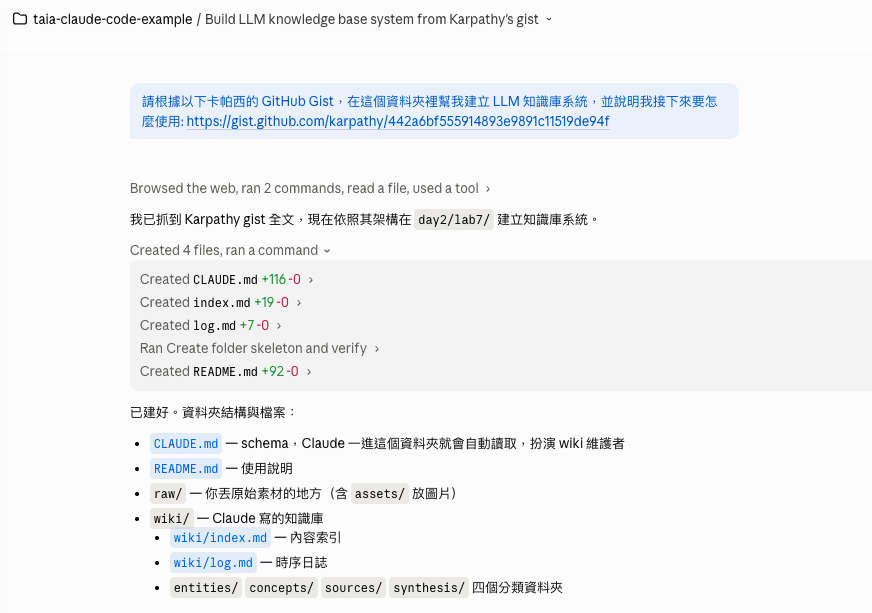
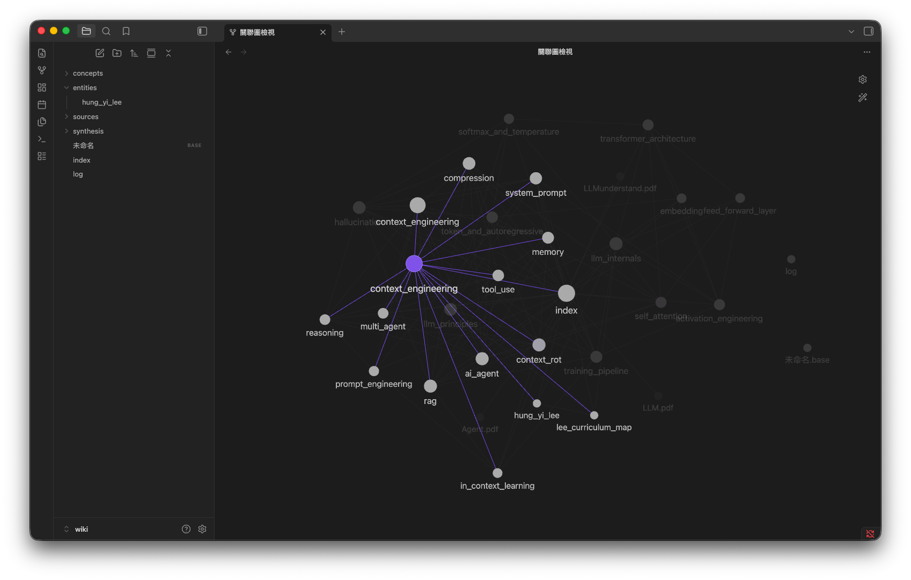
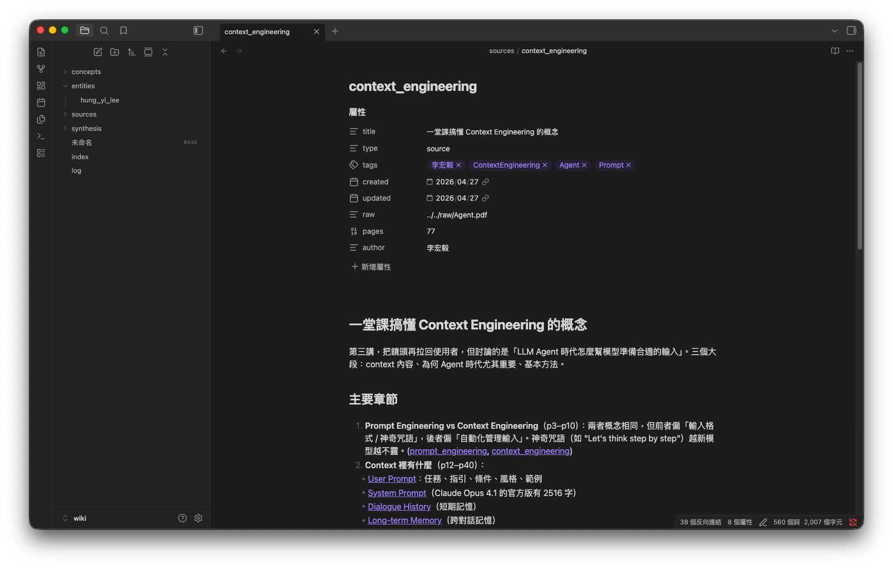

# Lab 7 建構自己的知識系統

依照 Andrej Karpathy 提出的 [LLM Wiki 模式](https://gist.github.com/karpathy/442a6bf555914893e9891c11519de94f) 建立的個人知識庫。Claude Code 是 wiki 維護者，你是策展人與提問者。

## 資料夾結構

```
lab7/
├── CLAUDE.md         # ★ schema：告訴 Claude 怎麼維護這個 wiki
├── raw/              # 你丟原始素材到這裡（PDF、md、文章、URL 內文…）
│   └── assets/       # 圖片附件
├── wiki/             # Claude 寫、你讀
│   ├── index.md      # 內容索引（先讀這個）
│   ├── log.md        # 時序日誌
│   ├── entities/     # 人物/組織/產品
│   ├── concepts/     # 概念/方法
│   ├── sources/      # 每筆素材的摘要頁
│   └── synthesis/    # 跨來源比較與分析
└── README.md
```

---

## 第一次怎麼起手

### 1. 開啟Claude Code，開啟專案目錄

### 2. 輸入提示詞，讓Claude Code建立知識庫架構

提示詞

```
請根據以下卡帕西的 GitHub Gist，在這個資料夾裡幫我建立 LLM 知識庫系統，並說明我接下來要怎麼使用: https://gist.github.com/karpathy/442a6bf555914893e9891c11519de94f
```



### 3. 將原始檔案放到 raw/ 目錄中，讓LLM擷取並建立知識庫

最快的試水溫方式：把 Karpathy 那篇 gist 本身存進 `raw/`，然後叫 Claude ingest，看它怎麼建出第一批頁面。

例如：把李宏毅老師的生成式AI教學投影片PDF檔案放到 `raw/` 目錄中，然後在Claude Code輸入下列提示詞

```
ingest raw/
```

之後再陸續丟你關心領域的文章、論文、會議筆記進去，wiki 就會慢慢長出來。

### 4. 使用 Obsidian 打開路徑 (儲存庫)

知識關聯圖



萃取出來的內容



---

## 詳細說明

### 0. 開啟 Claude Code 進這個資料夾

```bash
cd day2/lab7
claude
```

Claude 啟動時會自動讀取 [CLAUDE.md](CLAUDE.md)，進入「wiki 維護者」角色。

### 1. Ingest（吸收新素材）

把素材放進 `raw/`，例如：

- 直接把 PDF / markdown / txt 檔複製進 `raw/`
- 用 [Obsidian Web Clipper](https://obsidian.md/clipper) 把網頁存成 markdown 丟進來
- 直接貼 URL 給 Claude，請它先抓下來再 ingest

然後對 Claude 說：

> 請 ingest `raw/karpathy_llm_wiki.md`

Claude 會：讀素材 → 跟你討論重點 → 寫 `wiki/sources/<slug>.md` 摘要頁 → 更新相關的 entity/concept 頁 → 更新 `index.md` → 在 `log.md` 追加紀錄。一次通常會動 5–15 個檔案。

**建議**：一次只 ingest 一筆，邊讀摘要邊微調方向。

### 2. Query（提問）

直接問問題。Claude 會先讀 `index.md` 找相關頁，再合成附引用的答案。

範例：

> 比較 wiki 裡所有提到 RAG 的論點，哪些一致、哪些矛盾？

> Karpathy 對 LLM 的看法在這幾篇裡有怎麼演進？做個時間軸。

> 整理「prompt caching」相關的所有頁面成一份簡報草稿。

如果答案值得保留，請 Claude 把它存成 `wiki/synthesis/<slug>.md`。**探索的成果也會累積**，這是這個系統的精髓。

### 3. Lint（健檢）

每隔一段時間（或感覺 wiki 有點亂）：

> 請 lint 整個 wiki

Claude 會掃描矛盾、孤兒頁、缺頁、斷鏈、值得補的主題，**只報告不亂改**，等你確認再動手。

## 進階建議

- **用 git 版本控制**：`wiki/` 的每次更新都 commit，可隨時回溯。
- **配 Obsidian 瀏覽**：把這個資料夾當 vault 打開，graph view 看連結結構，邊聊天邊看 Claude 即時改動。
- **co-evolve schema**：用久了會發現 [CLAUDE.md](CLAUDE.md) 哪裡不順，直接改它（或請 Claude 提議）。Schema 是活的設定檔。
- **規模建議**：~100 篇來源、數百頁 wiki 以內，靠 `index.md` 找頁就夠了；再大才考慮接搜尋引擎（如 [qmd](https://github.com/tobi/qmd)）。


---

## 參考資料

- [Karpathy 原始 gist](https://gist.github.com/karpathy/442a6bf555914893e9891c11519de94f)
- [數位時代：用 Claude Code 管理 100 篇研究筆記](https://www.bnext.com.tw/article/90530/llm-knowledge-base-obsidian-claude-code)
- [數位時代：不用 Obsidian 也能建 AI 知識庫](https://www.bnext.com.tw/article/90650/andrej-karpathy-ai-how)
