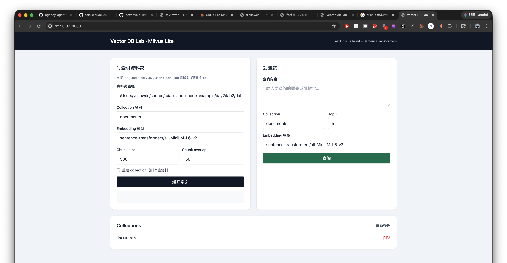
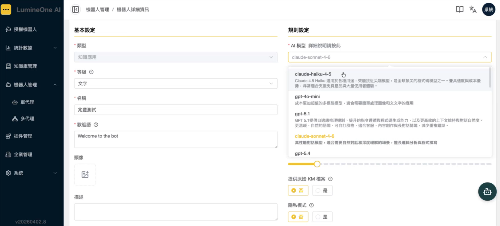
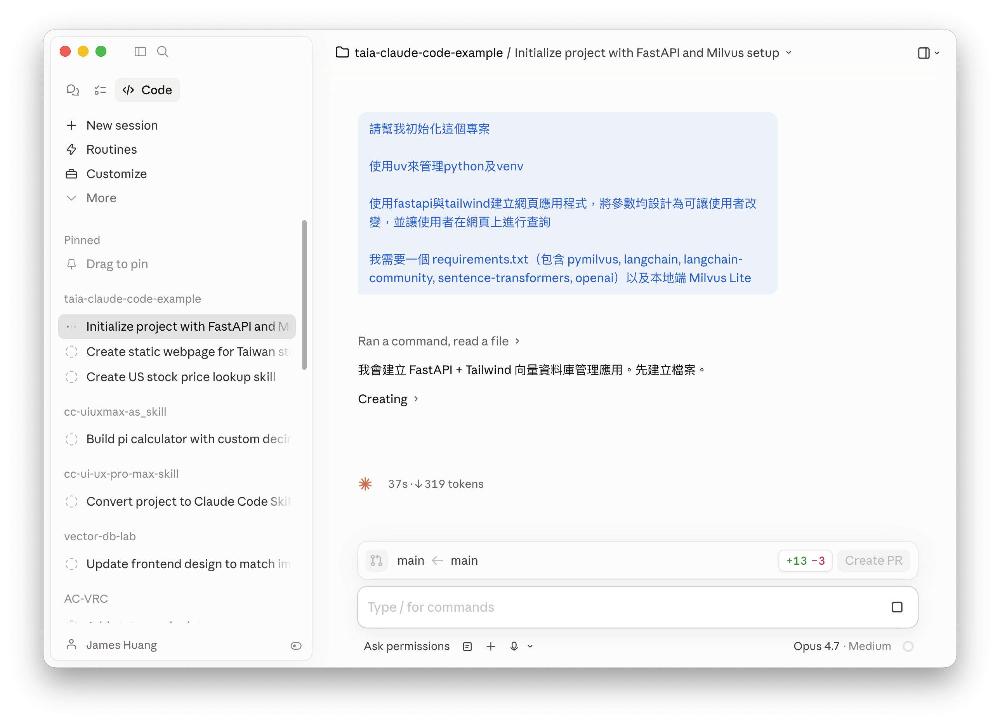

# Day2, Lab 2：召喚Claude Code更換頁面樣式

## 操作步驟

1. 開啟自己開發的應用程式，例如向量資料庫管理



2. 使用 Claude Code 開啟專案

3. 在Claude Code介面中，貼上欲更新的範例畫面 (或使用 `@圖檔檔名`)，並輸入提示詞

```prompt
套用這張圖片中的畫面設計風格，更新專案的前端網頁
```

例如，要套用的樣示圖片如下：



4. 在 Claude Code 中執行，Claude Code 自動進行重新設計


5. 設計完成後，網頁將更新為新的設計


---

## 參考資料

### 範例畫面功能說明

示範一個使用向量資料庫的管理及測試頁面，包含下列特點：

- 使用 Ollama 來運行地端開源的 Embedding Model
- 使用者可自行管理及變更 Embedding Model
- 使用地端向量資料庫來儲存向量後的資料
- 提供使用者索引資料夾中的檔案，儲存到向量資料庫
- 提供查詢功能，回傳使用者指定的最接近資料數目
- 這個範例程式使用 Python 開發，具備網頁功能及API服務

--- 

## 原始專案完整提示詞

專案：**向量資料庫的管理及測試**

提示詞：
```
請幫我初始化這個專案

使用uv來管理python及venv

使用fastapi與tailwind建立網頁應用程式，將參數均設計為可讓使用者改變，並讓使用者在網頁上進行查詢

我需要一個 requirements.txt（包含 pymilvus, langchain, langchain-community, sentence-transformers, openai）以及本地端 Milvus Lite

援 .txt / .md / .pdf / .py / .json / .csv / .log 等檔案的索引

```



---

## 免責聲明

本文件及所有相關程式碼、圖片、操作步驟均為**示範用途**，僅供教學與學習參考。

- 本範例不保證適用於正式生產環境，使用者應自行評估風險。
- 所有內容均以「現狀」提供，不附帶任何明示或暗示的保證。
- 引用外部之資訊，版權屬原著作人所有。
