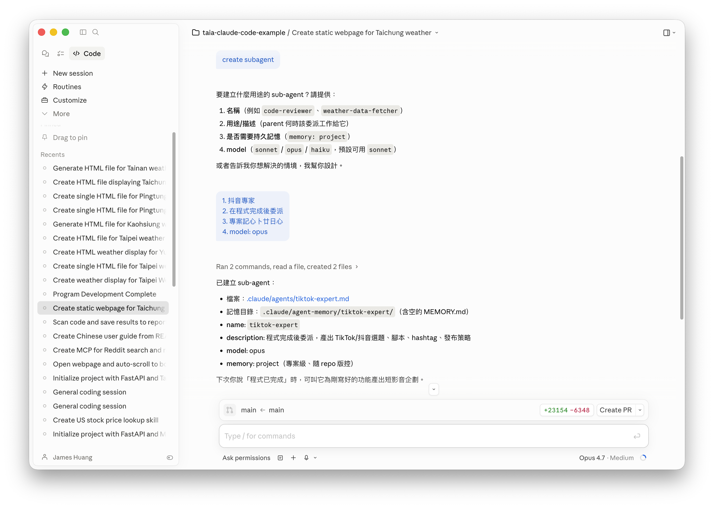
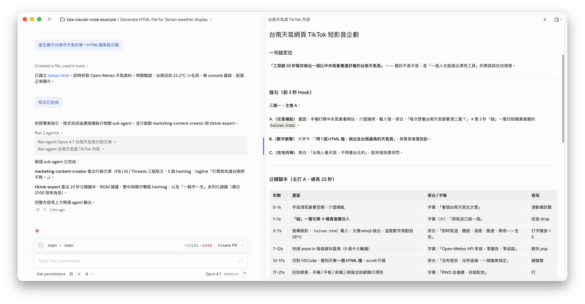

# Lab 3 "Sub Agents"：一人公司、多個 AI 代理人幫你完成任務

## 知識點

- Sub Agents
- Skill
- CLAUDE.md

## 操作步驟

### 1. 開啟Claude Code，並選擇專案目錄

### 2. 讓Claude Code建立子代理人 (Sub Agent)



### 3. 採用現成的代理人

- 下載 [https://github.com/msitarzewski/agency-agents/blob/main/marketing/marketing-content-creator.md](https://github.com/msitarzewski/agency-agents/blob/main/marketing/marketing-content-creator.md)

- 儲存到專案目錄下 `.claude/agents/<agent名稱>`

### 4. 採用 Humanizer 繁體中文版，讓文案內容"有人味"

- 下載 [https://github.com/kevintsai1202/Humanizer-zh-TW/blob/main/SKILL.md](https://github.com/kevintsai1202/Humanizer-zh-TW/blob/main/SKILL.md)

- 儲存到專案目錄下 `.claude/skills/<humanizer-zh-tw>`

### 5. 修改 CLAUDE.md，確保子代理人被正確驅動

- 開啟並編輯 CLAUDE.md 檔案

- 將下列內容複製貼上到檔案的最後

```
當程式已完成，檢查是否有接續執行的 sub agent
```

### 6. 修改 Sub Agent 檔案，加入 Humanizer 的指示

```
## Humanizer

run humanizer-zh-tw skill on content created by this agent before saving it to file to remove AI-generated text patterns and make it sound more natural and human-written.
```

### 8. 重新啟動 Claude Code

### 9. 輸入並執行下列提示詞

```
產生顯示台南市天氣的單一HTML檔案程式碼
```

### 10. 範例輸出



---

## 參考資料

- Humanizer-zh-TW: AI 寫作人性化工具（繁體中文版）: [https://github.com/kevintsai1202/Humanizer-zh-TW](https://github.com/kevintsai1202/Humanizer-zh-TW)

- The Agency: AI Specialists Ready to Transform Your Workflow: [https://github.com/msitarzewski/agency-agents](https://github.com/msitarzewski/agency-agents)

- GitHub 爆紅：144個AI員工職位 (12個部門) 開源免費用，各有性格、工作流與 KPI: [https://www.blocktempo.com/agency-agents-github-84k-stars-144-ai-employee-personas-open-source/](https://www.blocktempo.com/agency-agents-github-84k-stars-144-ai-employee-personas-open-source/)

---

## 免責聲明

本文件及所有相關程式碼、圖片、操作步驟均為**示範用途**，僅供教學與學習參考。

- 本範例不保證適用於正式生產環境，使用者應自行評估風險。
- 所有內容均以「現狀」提供，不附帶任何明示或暗示的保證。
- 引用外部之資訊，版權屬原著作人所有。
